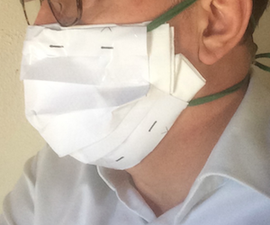

# Introduction
Ce masque de protection a été conçu et réalisé par un docteur vétérinaire praticien. Ce masque est constitué d'une feuille de papier A4, d'un filtre en tissu et de deux liens. Il est réalisable en moins de 10 minutes. 

# Tutoriel de Fabrication du Masque
Cliquer sur ce lien pour accéder aux instructions: <a href="http://papermask.github.io/papermask/TutorielMasquePapier.pdf " target="_blank"> tutoriel de fabrication du masque (format pdf)</a>

Cliquer sur ce lien pour accéder au tutoriel sur YouTube: <a href="https://youtu.be/h3pf3_3H_xY" target="_blank"> tutoriel vidéo </a>

# Patrons du Masque
* <a href="http://papermask.github.io/papermask/PatronMasque_Taille_XL-L.pdf" target="_blank"> Patron Taille XL-L  (Feuille Format A4) </a>
* <a href="http://papermask.github.io/papermask/PatronMasque_Taille_M-S.pdf" target="_blank"> Patron Taille M-S  (Feuille Format A4) </a>

# Contact/Information
Pour toute demande d'information, envoyer un e-mail à mypapermask@gmail.com

Ce masque ne se substitue pas aux consignes sanitaires préconisées par les autorités dans la crise sanitaire du COVID-19.

<a href="en.md"> English version </a> 
