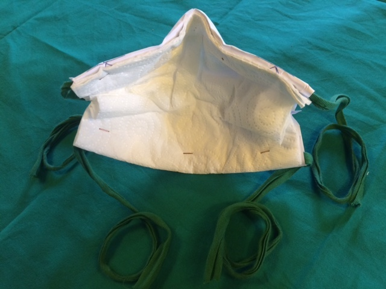

# Introduction
Ce masque en papier à usage unique est constitué d'une feuille de papier A4, d'un filtre en papier absorbant et de deux liens. Ce masque est réalisable en 5 à 7 minutes.

# Tutoriel de Fabrication du Masque
Cliquer sur ce lien pour accéder aux instructions: <a href="http://papermask.github.io/papermask/TutorielMasquePapier.pdf " target="_blank"> tutoriel de fabrication du masque (format pdf)</a>

Cliquer sur ce lien pour accéder au tutoriel sur YouTube: <a href="https://www.youtube.com/watch?v=clxBN6BWcx0 " target="_blank"> tutoriel vidéo </a>
 

# Patrons du Masque
* <a href="http://papermask.github.io/papermask/PatronMasque_Taille_XL-L.pdf" target="_blank"> Patron Taille XL-L  (Feuille Format A4) </a>
* <a href="http://papermask.github.io/papermask/PatronMasque_Taille_M-S.pdf" target="_blank"> Patron Taille M-S  (Feuille Format A4) </a>

Ce masque ne se substitue pas aux consignes sanitaires préconisées par les autorités.

